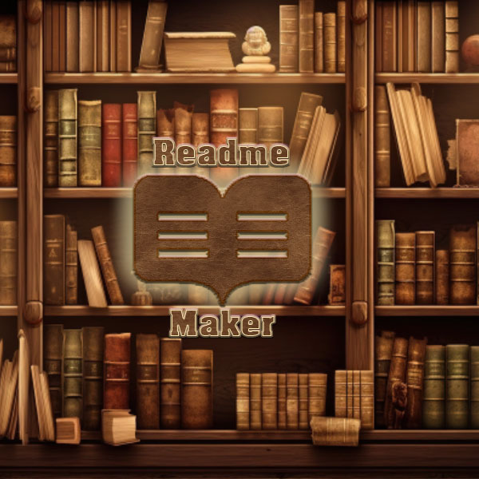
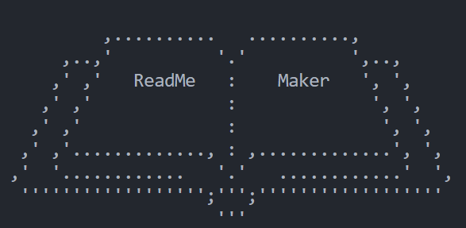
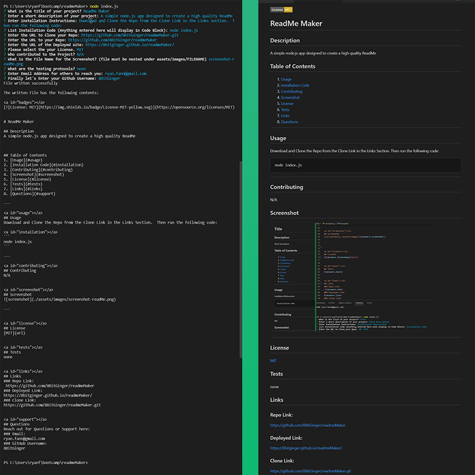

<a id="badges"></a>
[](https://opensource.org/licenses/MIT)

# ReadMe Maker

<div align="center">



</div>

## Description

#### _In today's fast-paced development world, efficiency matters!_

Ever wrestled with crafting a comprehensive, high-quality ReadMe file that showcases your project's brilliance? <br><br> This is a Node.js-powered solution that streamlines the process, letting you craft beautiful ReadMe Files with the efficiency of Node.js, using Inquirer.

---

## Table of Contents

1. [Usage](#usage)
1. [Installation Code](#installation)
1. [Technologies](#technologies)
1. [Contributing](#contributing)
1. [Screenshot](#screenshot)
1. [License](#license)
1. [Tests](#tests)
1. [Links](#links)
1. [Questions](#support)

---

<a id="usage"></a>

## Usage

#### Download and Clone the Repo

Clone Link in the <a href="#links">Links Section.</a> <br>

#### _then_

from the root directory run the following command:

<a id="installation"></a>

```
npm i
```

#### _then_

run the following command:

```
npm run create
```

#### _then_

This tool will guide you through a series of prompts to gather information about your project. <br><br>Afterward, you'll see the completed ReadMe content in the console and have it saved as a new file named 'newREADME.md'.

##### _Keep in mind that it will overwrite the contents of the previous file named newREADME.md. Enjoy!_

---

<a id="technologies"></a>

## Technologies

```
 "dependencies": {
    "badge-maker": "^3.3.1",
    "inquirer": "8.2.4"
  }
```

---

<a id="contributing"></a>

## Contributing

N/A

---

<a id="screenshot"></a>

## Screenshot




---

<a id="license"></a>

## License

[MIT](url)

---

<a id="tests"></a>

## Tests

_none_

---

<a id="links"></a>

## Links

<div align="center">

### [Clone](https://github.com/8BitGinger/readmeMaker.git)

### [Repo](https://github.com/8BitGinger/readmeMaker)

### [Deployed](https://8bitginger.github.io/readmeMaker/)

### [Video Walkthrough](https://drive.google.com/file/d/1mFlXQgKBNRDyWnkb5Hzv2XnH3eXIEaG-/view)

### [Portfolio](https://ryanfann.netlify.app/)

</div>

<a id="support"></a>

---

## Questions

_Reach out for Questions or Support here:_

### Email:

ryan.fann@gmail.com

#### GitHub:

[8BitGinger](https://github.com/8BitGinger)
